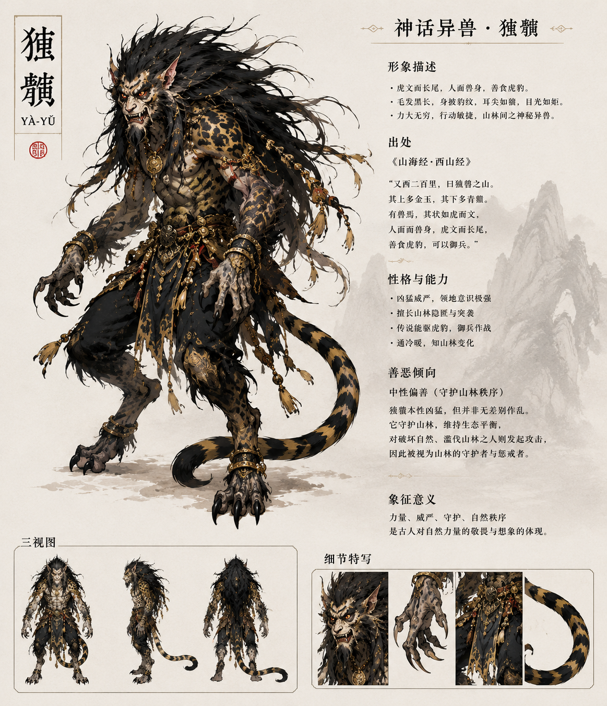

# Ya-Yu Concept

> Character visual reference only; this is not a Ya-Yu module, panel, or UI design.  
> 仅作为猰貐角色形象参考，不是 Ya-Yu 模块、面板或 UI 设计。

## English

### Story Concept

This project uses a story concept inspired by Yà-Yǔ (猰貐), rather than claiming to reproduce a historical source exactly.

Ya-Yu was a mountain deity who was poisoned and killed in a conspiracy between deities. The people responsible for his death were later imprisoned by the Heavenly Emperor. Years later, six sorcerers revived Ya-Yu; their act of revival has no causal connection to the people who killed him. The poison remained inside him after revival: it left a permanent knot in his body and made parts of him impossible to control.

When the knot takes hold, Ya-Yu becomes a beast. He withdraws into the mountains, fearing both the harm he may cause and the fact that he is beginning to enjoy the force of that transformation. No person controls Ya-Yu: the poison knot itself is the only source of his recurring loss of control.

At the end, Ya-Yu draws Hou Yi to him. He appears to be a monster attacking the world, but is seeking a final choice that the curse cannot take from him. He accepts Hou Yi's arrow, and the remaining divine power becomes a protective spirit of the mountain.

### Sound Parameters

| Story element | Module meaning |
|---|---|
| **Poison** | A macro control for distortion amount and/or noise proportion. It moves the sound from the clean **Prime** state toward unstable **Reborn**, and then toward the more extreme **Final** state. |
| **Six sorcerers** | Six macro parameters representing the act of revival. Their exact assignments remain open until the hardware control layout is defined. |

### Three States

| State | Sound role |
|---|---|
| **Prime** | The remaining clear self: clean, airy, resonant, and controlled. |
| **Reborn** | Revival and corruption: stronger feedback, distortion, noise, and unstable energy. |
| **Final** | The confrontation and chosen end: experimental, fragmented, destructive, and capable of resolving into silence or a remaining drone. |

## 中文

### 故事概念

本项目采用受猰貐故事启发的故事概念，不试图逐字复述任何历史文献。

猰貐本是山中的神祇，死于一场神祇之间的阴谋：他被设计毒杀。杀死他的人后来已被天帝囚禁。多年以后，六个巫师将猰貐复活；这场复活与杀死他的人没有因果关系。毒药却没有消失，而是在他的身体里留下了无法解开的结，使他无法完全控制自己。

每当这道结发作，猰貐便会化为凶兽。他逃进深山，既害怕伤害他人，也害怕自己正在逐渐享受那种失控的力量。猰貐不受任何人控制；使他反复失控的唯一来源是体内的毒结本身。

最终，猰貐将后羿引向自己。他表面上像是在袭击人世，真正等待的却是一件诅咒无法夺走的事：由自己选择结局。他迎向后羿的箭，将残存神力留在山中，成为守护土地的山灵。

### 声音参数

| 故事元素 | 模块含义 |
|---|---|
| **Poison（毒药）** | 用作失真量和/或噪音比例的宏参数。它让声音从干净的 **Prime** 逐步过渡到不稳定的 **Reborn**，再进入更极端的 **Final**。 |
| **六个巫师** | 代表复活过程的六个宏参数。具体对应哪些声音参数，等待硬件控制布局确定后再分配。 |

### 三个状态

| 状态 | 声音角色 |
|---|---|
| **Prime** | 残存的清醒自我：干净、空灵、共振且可控制。 |
| **Reborn** | 复活与腐化：更强的回授、失真、噪音与不稳定能量。 |
| **Final** | 对战与自主选择的结局：实验性、碎片化、破坏性，并可以收束到静音或残留 Drone。 |
